# HTB Sau Write-up

## Overview

Sau is a beginner-friendly Linux machine that uses a service called *Request Baskets*. This service has a security vulnerability (CVE-2023-27163) that allows attackers to trick the server into sending unauthorized requests. By exploiting this flaw, we can access another service, *Maltrail*, which has its own weakness that lets attackers execute commands without logging in. This gives us control over the machine as the user `puma`. Finally, we exploit a mistake in the system's sudo settings to gain full control as the `root` user.

## Enumeration

A quick Nmap scan revealed the following open ports:
```
nmap -sCV -oA nmap/sau 10.10.11.224 -Pn
```


- **SSH** on port 22
- **HTTP** on port 80
- Another **HTTP** on port 55555 (we'll investigate this further)

We start by checking the website. This appears to be an e-commerce website that allows you to create a basket. After creating the basket, it provides a link where you can view its contents by entering a token.

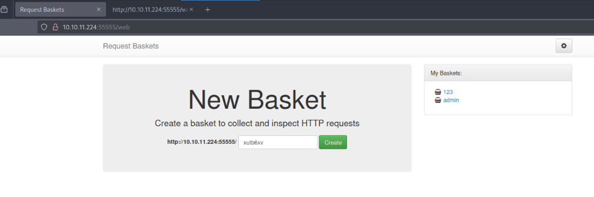


### Testing for Hidden Directories

We attempted to enumerate hidden directories, but got no valuable results.

### Exploring the Application

The application has a "master settings" page that requires a master token to access every basket.

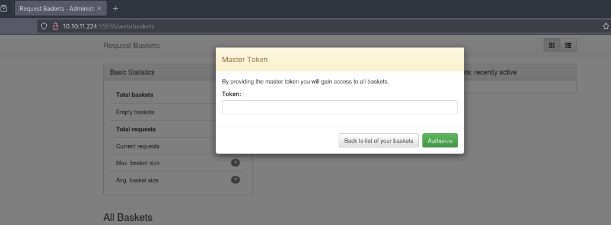

The *Request Baskets* service is used to create the web application, and it is leaking the version number at the bottom of the page.

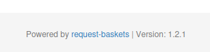

A quick Google search led to an exploit for *Request Baskets v1.2.1* ([CVE-2023-27163](https://github.com/entr0pie/CVE-2023-27163)).

### Understanding the Vulnerability

The vulnerability is an SSRF (Server-Side Request Forgery) discovered in *Request Baskets v1.2.1*. SSRF occurs when an attacker tricks a server into making requests to unintended locations, such as internal systems or external servers.

Here's a simplified analogy: Imagine you're at a restaurant, and you can only order through a waiter (the server). Instead of ordering food, you secretly ask the waiter to do something outside the restaurant. The waiter follows your instructions without realizing your intent.

In server contexts, SSRF can lead to the exposure of private information or even unauthorized access to other parts of the network.

### Testing the SSRF Vulnerability

Before exploiting the vulnerability, we first tested it using Burp Suite. Using a payload from the Proof of Concept (PoC), we created a basket. When accessed, it made a request to our local machine.

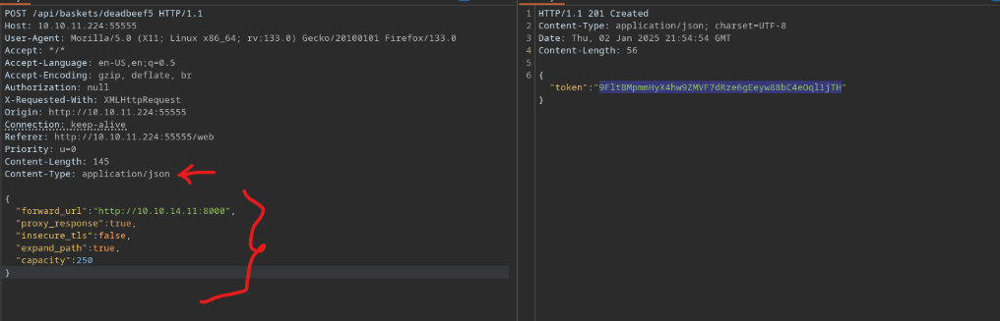

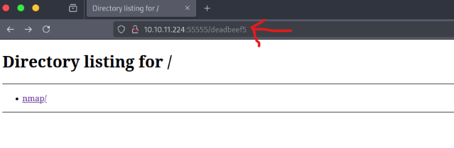

We also tried setting the forward URL to `localhost` to reveal hidden internal frameworks. This exposed a page running *Maltrail* v0.53.

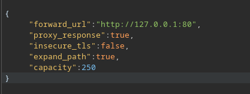

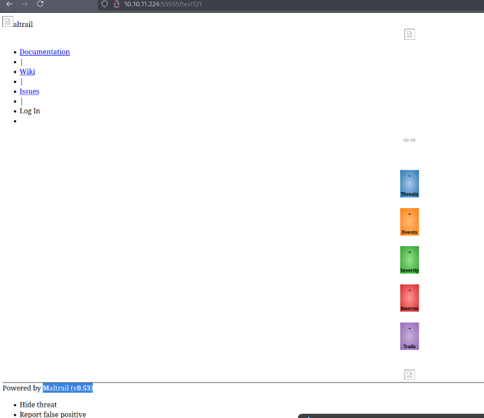

## Exploitation

A Google search revealed that *Maltrail v0.53* is vulnerable to OS Command Injection ([PoC Exploit](https://github.com/spookier/Maltrail-v0.53-Exploit)).

The vulnerability exists because the service uses an unsanitized username input. Attackers can inject commands into the username, which are then executed by the service using `subprocess.check_output()`.

In shell scripting, the semicolon (`;`) is used to run multiple commands sequentially. If an attacker includes a semicolon in the username followed by a command, the shell executes it. This allows us to execute arbitrary commands.

### Getting a Reverse Shell

By setting up a listener and executing the exploit, I got the user shell.
```
nc -lnvp 9001
```

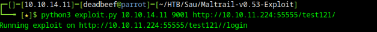

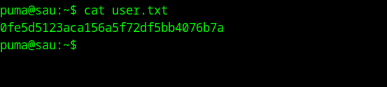


## Privilege Escalation

We checked the sudo capabilities of the puma user and found that it could run certain commands without requiring a sudo password.

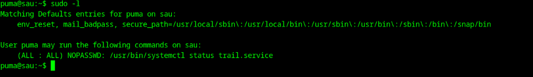


First, we examined the trail.service file and discovered that it runs server.py. However, since this file is owned by root, we couldn't directly exploit it.

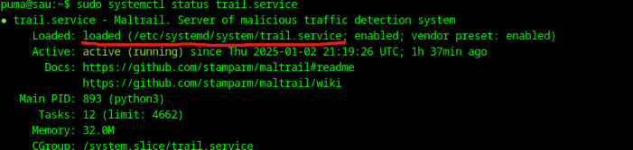

### Exploiting systemctl binary

We checked [GTFObins](https://gtfobins.github.io/) for the systemctl binary, which can be used to execute commands. Since the puma user has sudo privileges, we attempted to execute a shell as root using the 
following command:

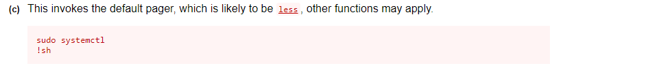

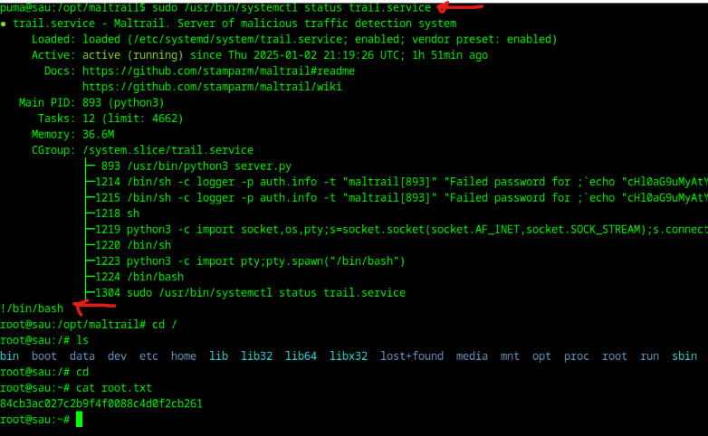

## Conclusion
- We successfully exploited the SSRF vulnerability in Request Baskets to expose the Maltrail version. 
- We leveraged an OS Command Injection vulnerability to execute a reverse shell. 
- After gaining access as the puma user, we escalated privileges using the systemctl binary and obtained root access to the machine.